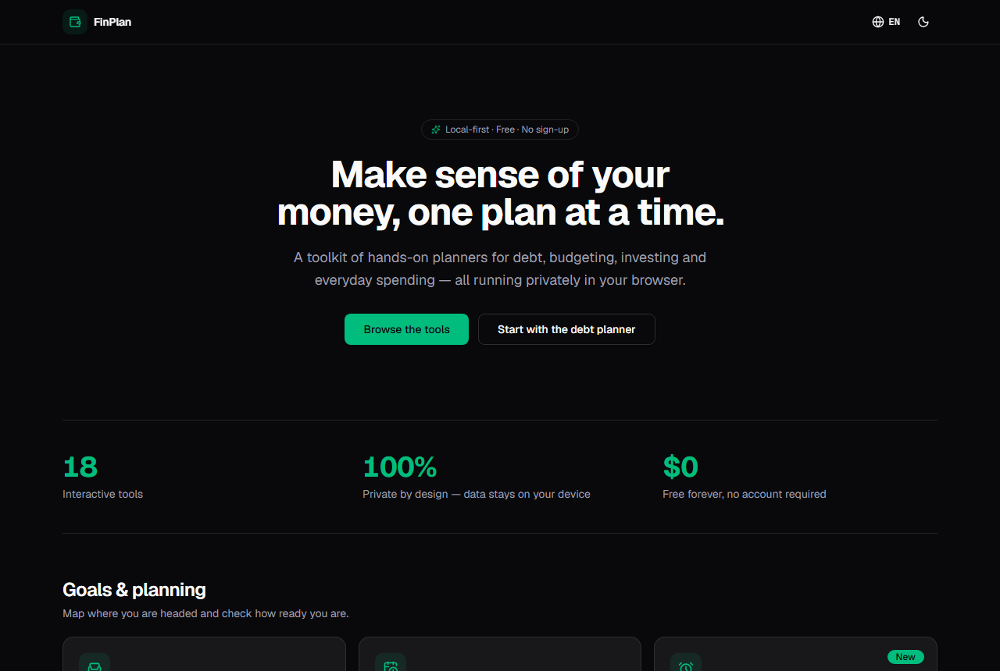
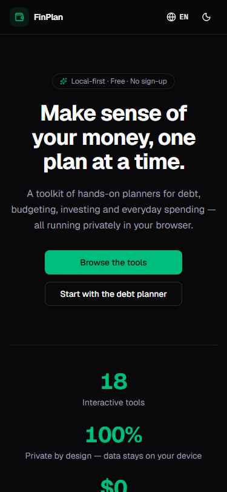
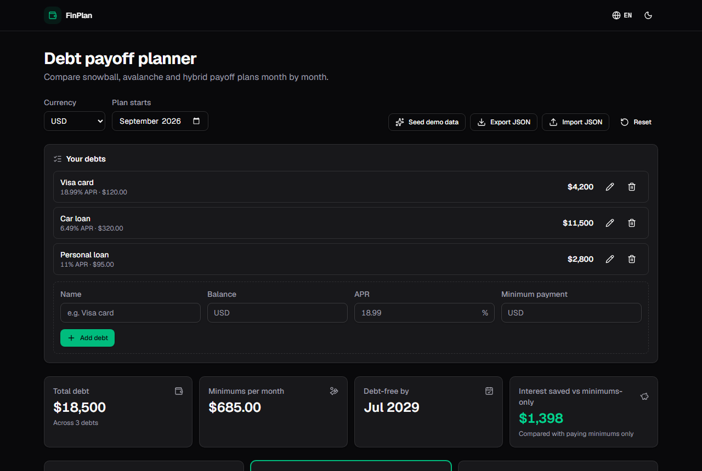
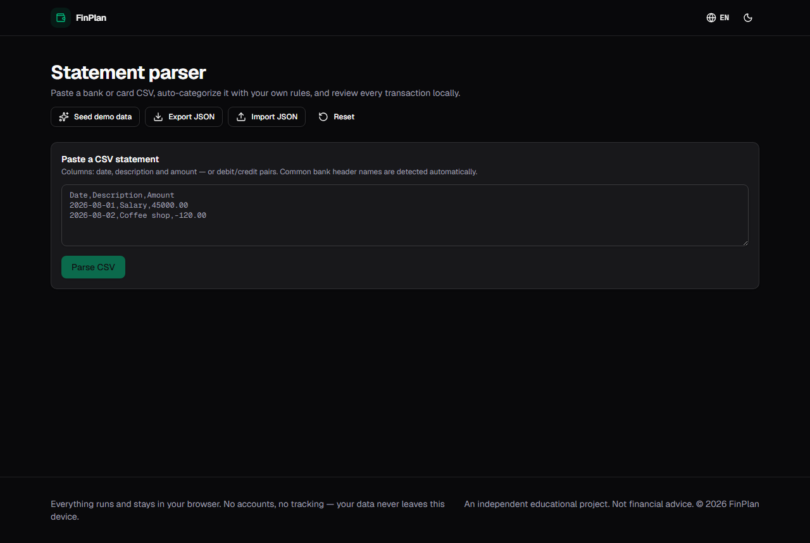

# FinPlan

FinPlan is a local-first, bilingual personal-finance planning toolkit built with Next.js, TypeScript, Zustand, Recharts, and Vitest. It ships 18 focused tools behind one responsive hub, keeps user data in the browser, and exports as a static site for GitHub Pages.

[Live demo](https://tanaboonjew.github.io/finplan/) · [English](https://tanaboonjew.github.io/finplan/en/) · [ไทย](https://tanaboonjew.github.io/finplan/th/)

> **Financial safety:** FinPlan is a planning and educational toolkit. It does not provide personalized financial, investment, tax, or insurance advice. Users should verify assumptions, rates, tax rules, product terms, and decisions against current authoritative information or a qualified professional.

## Screenshots

| Desktop hub | 375px mobile hub |
|---|---|
|  |  |

| Debt payoff planner | CSV statement parser |
|---|---|
|  |  |

Additional screenshots are in [`docs/screenshots/`](docs/screenshots/).

## 1.0 toolset

The 1.0 scope is frozen at these 18 tools. Routes below are shown without the required locale prefix (`/en` or `/th`).

| # | Route | Tool |
|---:|---|---|
| 1 | `/debt` | Debt payoff planner |
| 2 | `/budget` | Yearly budget |
| 3 | `/retirement` | Retirement planner |
| 4 | `/jar` | Six Jars manager |
| 5 | `/loan` | Loan explainer + refinance break-even |
| 6 | `/tax` | Configurable tax planner |
| 7 | `/timeline` | Life goals timeline |
| 8 | `/pay` | Subscriptions tracker |
| 9 | `/dca` | DCA fee comparator |
| 10 | `/flow` | Cash flow planner |
| 11 | `/credit-card` | Credit card comparison |
| 12 | `/travel-card` | Travel card comparator |
| 13 | `/insurance` | Insurance manager |
| 14 | `/strategy` | Investment strategy board |
| 15 | `/kingdom` | Gamified budget kingdom |
| 16 | `/wake-up` | Financial readiness quiz |
| 17 | `/portfolio-analyzer` | Portfolio analyzer |
| 18 | `/statement` | CSV statement parser |

The statement tool is intentionally **CSV-first** in 1.0. PDF/OCR parsing is not faked and is not part of the release scope.

## Architecture

FinPlan is designed as a static, local-first application rather than a hosted finance service:

- `src/app/[locale]/` contains the statically exported English and Thai routes.
- `src/lib/finance/` contains pure finance/domain functions. React components should not perform raw financial calculations inline.
- `src/lib/storage/` contains versioned Zustand/localStorage stores and import/export validation.
- `src/lib/demo/` contains deterministic demo data used to make non-trivial tools inspectable without entering personal information.
- `src/components/tools/` contains tool UIs; `src/components/shared/` and `src/components/ui/` contain reusable interface primitives.
- `src/messages/en.json` and `src/messages/th.json` are the user-facing i18n catalogs.
- `docs/specs/` defines the intended behavior of every tool. `MASTER-PLAN.md` is the roadmap/status SSOT.
- `tests/` covers finance logic, persistence/import boundaries, demo seeds, shared components, i18n shape, and route/tool registry invariants.

There is no application server, user account system, analytics pipeline, or remote database in the 1.0 architecture.

## Data and import safety

Tool state is stored locally in the browser. JSON exports use a FinPlan envelope with tool and schema-version metadata, and import paths validate shape/version before replacing state. The statement parser reads CSV in the browser, validates dates and amounts, supports common header aliases and debit/credit layouts, and reports malformed rows instead of silently coercing them.

Because browser storage can be cleared by the user, browser, operating system, or privacy tools, important plans should be exported periodically. Do not import files from untrusted sources without reviewing their contents.

## Offline / PWA behavior

FinPlan includes a web app manifest and a small service worker. After a successful online visit, the English and Thai hubs are pre-cached and subsequently visited same-origin pages/assets are cached for offline reuse. Network responses are preferred when available so deployments are not permanently pinned to stale assets.

Offline caching is best-effort browser behavior; it is not a backup mechanism. User finance data continues to live in local browser storage independently of the page cache.

## Development

### Requirements

- Node.js 22 (matches GitHub Actions)
- npm

### Install and run

```bash
npm ci
npm run dev
```

With the configured GitHub Pages `basePath`, local routes are served below `/finplan`, for example `http://localhost:3000/finplan/en/`.

### Quality gates

```bash
npm run lint
npm run typecheck
npm test
npm run build
```

`npm run build` uses Next.js static export and writes the deployable site to `out/`. The GitHub Pages workflow runs the same install, lint, typecheck, test, and build gates before deployment.

## Release discipline

The roadmap and Definition of Done live in [`MASTER-PLAN.md`](MASTER-PLAN.md). The 1.0 tool list is frozen: stabilization takes priority over adding more calculators. Ideas that do not belong to the current roadmap are recorded in [`docs/POST-1.0-BACKLOG.md`](docs/POST-1.0-BACKLOG.md) instead of silently expanding release scope.
